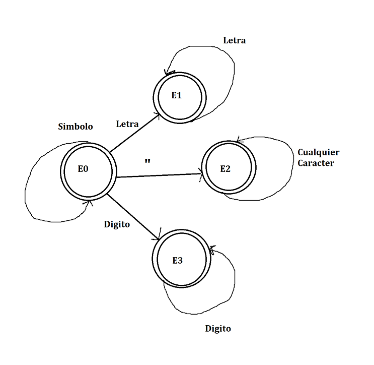

# Manual Técnico

**Descripción Breve:** este proyecto consiste en la implementación de un analizador léxico y análisis de un input para determinar un país en específico. La interfaz gráfica está realizado Tkinter de Python, mientras que todo lo demás fue llevado a cabo por el lenguaje de programacion Fortran.


### Analizar
Dentro del prorama existe unua subrutina con el nombre analizar, la cual se encarga de analizar la entrada que viene desde python, continuacion se expresa la subrutina:

```Fortran
subroutine analizar(this, entrada)
```

Es en esta subrutina en donde ocurre la logica del proyecto, ya que dentro de la subrutina, se puso un `select case` el cual se utilizaría para movilizarnos entre los distintos estados que puede llegar a tener. Desde el estado 0 que verifica si cada caracter pertenece a los caracteres validos, yendo desde el abecedario hasta los numeros enteros, pasando también por algunos simbolos especiales y cadenas de texto.

 Ahora bien, para los estados de error, se maneja al momento que se terminaba la cadena de texto, digitos, caracteres especiales, etc. Simplemente se validaba si pertenecía o no al lenguaje según su categoría.

### Reporte HTML
Para la realización del mismo, se utilizaorn dos arrays bastante importantes para toda la aplicación en sí, la cual es en donde se iban guardando los lexémas válidos y errores encontrados en el análisis. Con dichos arreglos, se procedió a extraer sus valores almacenados y ya con ellos se iba extrayendo la información útil para generar los reportes.

Las subrutinas empleadas para la creacion de los html fueron las siguientes:
```Fortran
 subroutine generarReporteErrores(this, archivo)
```

```Fortran
 subroutine generarReporteTokens(this, archivo)
```

### Grafico.dot
Este modulo nos crea un archivo el cual representa de manera textual como se diseña el grafico de los contintentes con cada uno de sus paises. Este se encarga de validar que la saturación del
continente se encuentre en los porcentajes adecuados, es decir, que cada continente se va a ir pintando de diferentes colores segun su saturación; blanco para indicar que su saturación se 
encuentra de 0%-15% y rojo para indicar que la saturación se encuentre por encima del 75%.

La subrutina encargada de este proceso es la siguiente:
```Fortran
subroutine graficar(this, continentes, grafico)
```
### Conexión Fortran - Python
Para realizar la conexión, se utilizó la librería `subprocess` de Python, el cual permite ejecutar un subproceso. Lo que se hizo es ejecutar el .exe del Main de Fortran y enviarle todo lo capturando en el input de la GUI de Tkinter. El método responsable de este proceso es el `def ejecutar_fortran(contenido)`, a continuación se detalla la parte importante de esa funcion:

```Python
proceso = subprocess.Popen(["./Proyecto1/main.exe"], stdin =subprocess.PIPE, stdout=subprocess.PIPE, stderr=subprocess.PIPE, text=True)
    stoudt, stderr = proceso.communicate(input=contenido)
```

Una vez mandada la información de python a fortran, este crea los archivos html con los tokens y/o errores del programa, además del archivo .dot del grafico que se mostrará en la ventana de la 
interfaz de Python.

### Automata

