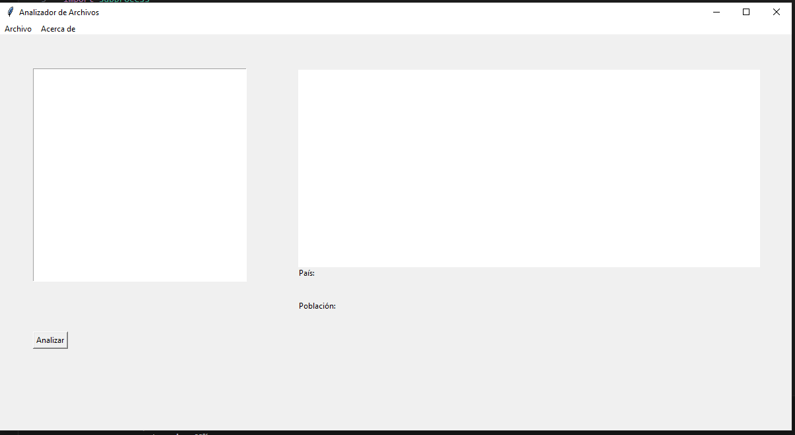
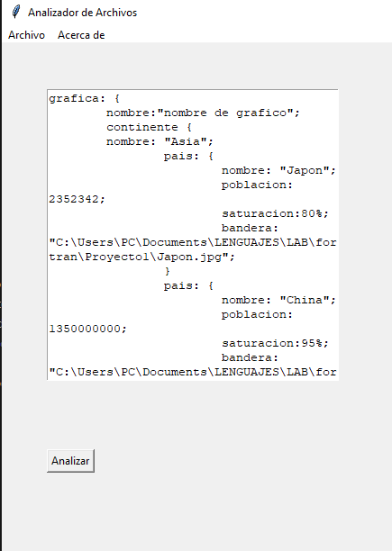
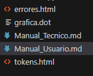
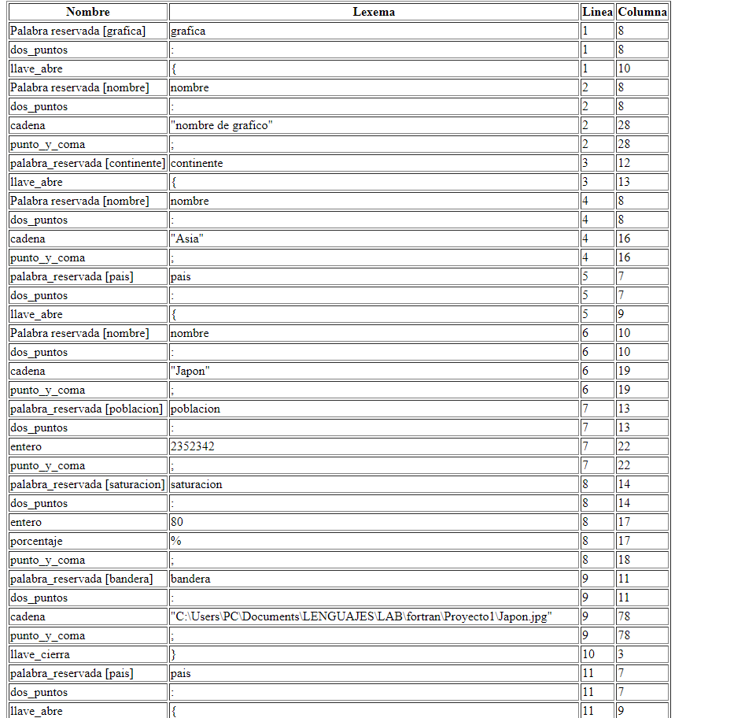
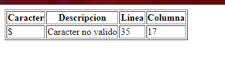

# Manual De Usuario

En esta ocasión se realizó un proyecto con el propósito de crear un estilo de editor de texto para poder determinar el mejor país para establecer un comercio basado en la saturación de los paises propuestos en el archivo .ORG que se debe de cargar.

Para poder usarlo, se requiere descargar la carpeta completa llamada `Proyecto1` del repositorio de Github, una vez descargados los archivos, se inicia el visualcode y en la consola se ingresa 
a la carpeta donde se guardaron estos archivos `cd Projecto1`, posteriormente se selecciona la ventana de Python `ventana.py` y este ejecutará la interfaz.

En esta pantalla se mostrará la interfaz de la imagen, la cual contiene un menú desplegable en la parte superior izquierdo de la ventana llamado `Archivo` , este despliega 3 opciones los cuales son `Abrir, Guardar y Guardar como`. La opcion abrir nos permitirá escoger los archivos de extensión .org como en este caso `entrada.org` el cual será mostrado en el cuadro de texto. A su vez esta pantalla cuenta con una opción llamada `Acerca de`, la cual muestra la información del estudiante.  

Cuando ya se haya seleccionado el archivo, el cuadro de texto se llenará de los datos que contenga el archivo entrada. Posteriormente si usted presiona el boton `Analizar`, el programa se ejecutará, llamado a todas las funciones y subrutinas que se encuentren en el programa fortran.

Como resultado del análisis se observará que han aparecido varios documentos en nuestra inferfaz de visualcode, las cuales son los archivos html y la grafica.

Esta tabla mostrará todos los tokens, lexemas y cadenas que se encuentren en nuestro archivo de entrada. Cabe recalcar que estos serán mostrados después del análisis de nuestro programa de fortan.

De igual manera que en la tabla de Tokens, esta tabla mostrará todos los errores de nuestro programa, es decir, todos los caracteres no validos que se encuentren en nuestro archivo de entrada. 

